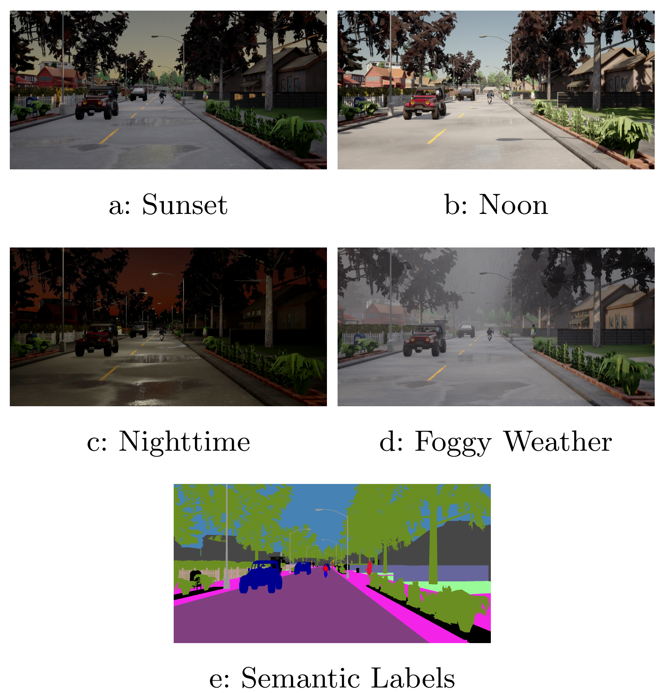
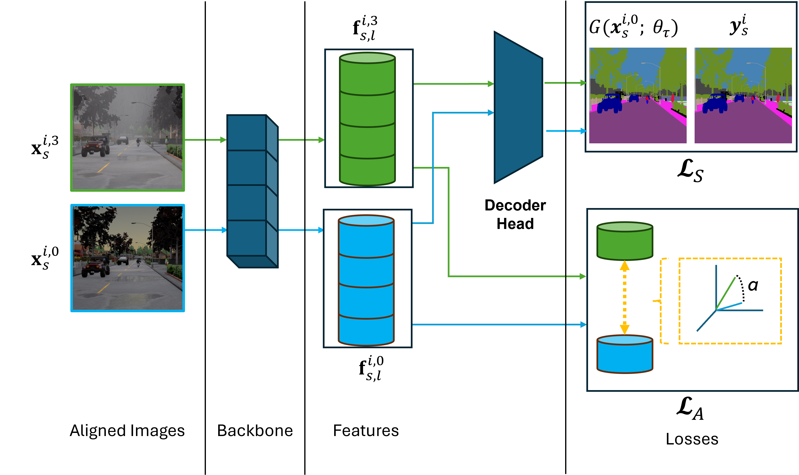
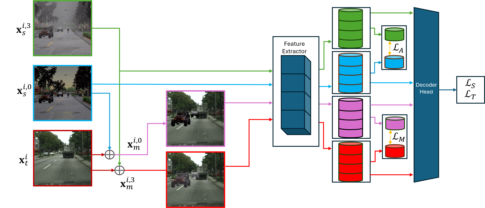

# Leveraging Contrastive Learning for Semantic Segmentation with Consistent Labels Across Varying Appearances

[](https://arxiv.org/abs/2412.16592)

Repository for the paper Leveraging Contrastive Learning for Semantic Segmentation with Consistent Labels Across Varying Appearances.

This paper introduces a novel synthetic dataset that captures urban scenes under a variety of weather conditions, providing pixel-perfect, ground-truth-aligned images to facilitate effective feature alignment across domains. Additionally, we propose a method for domain adaptation and generalization that takes advantage of the multiple versions of each scene, enforcing feature consistency across different weather scenarios. Our experimental results demonstrate the impact of our dataset in improving performance across several alignment metrics, addressing key challenges in domain adaptation and generalization for segmentation tasks. This research also explores critical aspects of synthetic data generation, such as optimizing the balance between the volume and variability of generated images to enhance segmentation performance. Ultimately, this work sets forth a new paradigm for synthetic data generation and domain adaptation.

## Downloads
Dataset can be downloaded from [here](https://link) (not ready yet)


## About the dataset

This repository includes the synthetic urban-scene dataset introduced in the paper,
named CARLA-Four-Aligned-Ground-Truths (abbreviated CARLA-4AGT). CARLA-4AGT is
generated with the CARLA simulator and is specifically designed to study
contrastive learning and feature alignment for semantic segmentation across
varying appearances.

The dataset contains multiple versions of each scene rendered under four
distinct weather/illumination setups (Noon, Sunset, Nighttime, Foggy). All
variants are pixel-perfect and ground-truth-aligned, enabling per-pixel
supervision and feature-level alignment across appearances.

Key properties and statistics:

- 4 Appearances per layout (Noon, Sunset, Nighttime, Foggy)
- ~5,000 unique scene layouts
- ~20,000 (4 appearances × ~5,000 layouts)
- 16 labeled classes (common with Cityscapes-style setups)
- Includes RGB images, pixel-perfect semantic labels, and configuration files
	to reproduce the simulation scenes.

Designed for domain adaptation (UDA) and domain generalization (DG) experiments,
CARLA-4AGT supports protocols that enforce feature consistency across
appearances and enables controlled studies on the trade-off between dataset
volume and visual variability.



## About the method

Our proposed method leverages the CARLA-4AGT dataset’s unique property: each scene is rendered under four distinct weather/illumination conditions, with pixel-perfect ground-truth alignment. The core idea is to enforce feature consistency across these different appearances of the same scene, enabling robust domain adaptation (UDA) and domain generalization (DG) for semantic segmentation.

Our approach introduces a feature alignment module that extracts features from multiple layers of a segmentation model for two different appearances of the same scene and enforces their similarity using an alignment loss. This is combined with the standard cross-entropy loss for segmentation. The alignment can use various distance metrics (e.g., cosine similarity, MMD, L2). For UDA, the method also proposes a cross-domain MixUp, overlaying source and target images using semantic masks to further enhance feature alignment.



This method enforces feature consistency across different appearances of the same scene by aligning features at multiple layers of the segmentation model. For each scene in CARLA-4AGT, the model extracts features from two images with different weather/illumination conditions but identical ground truth, and applies an alignment loss (e.g., cosine similarity, MMD, or L2) in addition to the standard segmentation loss. This encourages the model to learn appearance-invariant representations, improving generalization to new domains and conditions.

We further extend this approach to Unsupervised Domain Adaptation (UDA) pipelines such as DAFormer and HRDA. Here, we use DACS-style MixUp to create two semantically aligned mixed images from different appearances of the same ground truth, providing richer and more diverse training samples for UDA. This combination of multi-level feature alignment and cross-appearance MixUp enables more robust and efficient generalization to new domains and challenging conditions, consistently outperforming standard synthetic data and training protocols in both UDA and DG settings.



## Citation

If you use CARLA-4AGT or our method, please cite:

```
@article{montalvo2024carla4agt,
  title={Leveraging Contrastive Learning for Semantic Segmentation with Consistent Labels Across Varying Appearances},
  author={Javier Montalvo and Roberto Alcover-Couso and Pablo Carballeira and Álvaro García-Martín and Juan C. SanMiguel and Marcos Escudero-Viñolo},
  journal={arXiv preprint arXiv:2412.16592},
  year={2024},
  url={https://arxiv.org/abs/2412.16592}
}
```


